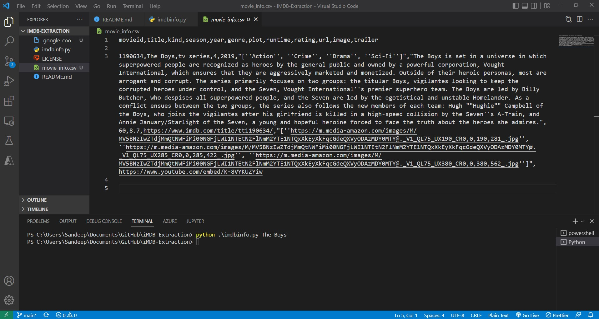

# iMDB-Extraction

It Searches and base on Movie Type it Extract data - Like Title Image[3-format],Description, Rating into a csv file.
That csv File can easily imported into database

Also It Scrapes Movies/Series Trailer

iMDB-Extraction is a Web -Scraping Script to Extract Data from The IMDB Website

> Works For Both Movies and Series

## Features

- It Scrapes Images title,Description,Rating
- Three image based on quality
- Stores data into CSV file
- It can be imported into database easily
- Also Scrapes Trailer from Google

## Dependencies

Package needed for running Script:

- [IMDb]
- [BeautifulSoup]
- [requests]
- [googlesearch]
- [urllib]
